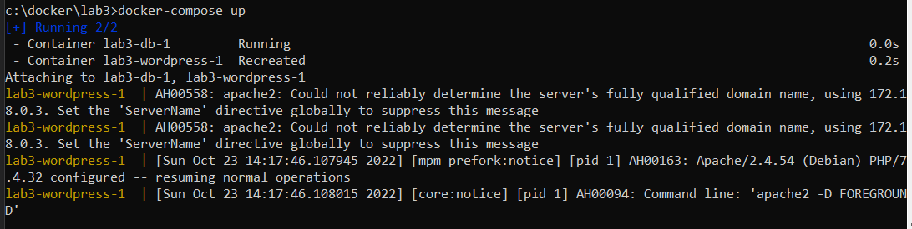
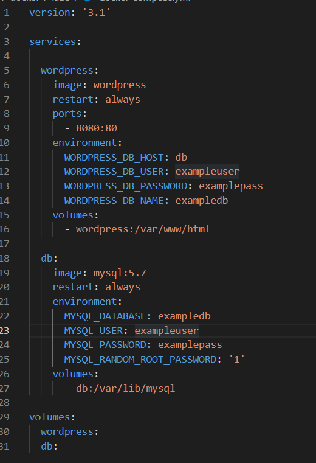
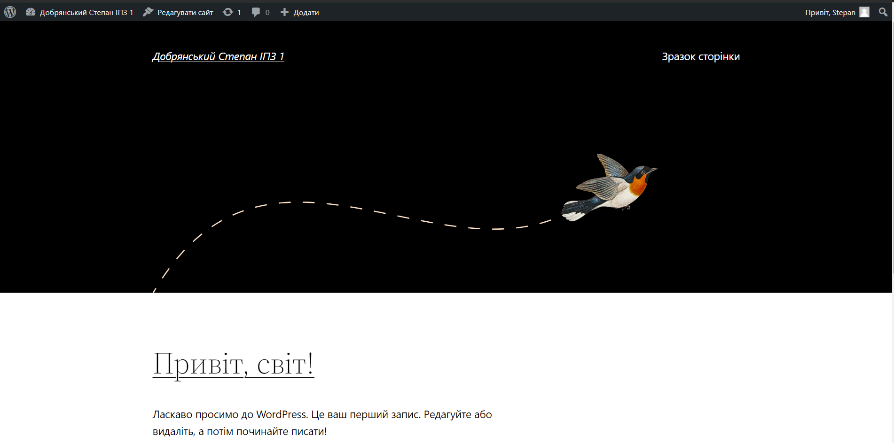
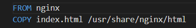
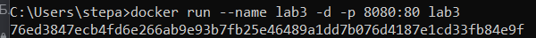
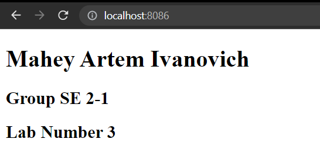

# Лабораторна робота №3
## Теорія
__Docker Compose__ - це інструмент, що входить до складу Docker. Він призначенний для виконання завдань пов'язаних з розгортуванням проектів.
__YML__ - це сучасний формат серіалізації даних, орієнтований на зручність використання.
__Переваги формату YML:__
1. Короткий і зрозумілий 
2. Використовує структури даних, характерні для мов програмування
3. Легко реалізується
4. Дуже виразний і розширний
5. Допускає простий потоковий інтерфейс

__Недоліки формату YML:__
1. Існує дуже багато програм, які вже створено за допомогою XML або JSON, тому розробнику важко замінити це на YML
2. Якщо говорити про популярність, XML має набагато більш зрілу екосистему, ніж YML
3. Існують додаткові застереження під час написання коду YML. Навіть якщо ви неправильно вставите один пробіл під час відступу, ваш код може перестати працювати
4. Існує багато способів представлення даних у YML та створення ієрархії даних. Тому він складний для обробки. Тому JSON і XML мають кращу продуктивність, ніж YML

## Практика
### Навести приклад створення та збирання образа за допомогою Docker Compose.

Потрібно створити файл з назвою __docker-compose.yml__, там потрібно налаштувати __Wordpress__. Коли все зроблено можна зробити __image__ за допомогою команди __docker-compose up__.

### Створення HTML сторінки та занесення її в Docker Image.
Спочатку створив файл index.html та файл Dockerfile.

__Dockerfile:__ 

Потім створити __image__ за допомогою __docker build -t (назва)__

__Запуск контейнера на порті 8080:__

Посилання на мій [сайт](https://hub.docker.com/repository/docker/stepan103/lab3)

### Скачати Docker Image когось із групи і розвернути в себе контейнер з HTML сторінкою на порті 8086 ззовні.

Я скачав [image](https://hub.docker.com/repository/docker/jerirov/lab-3-os) Артема Магея
