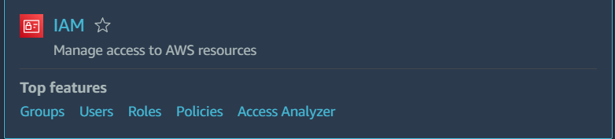
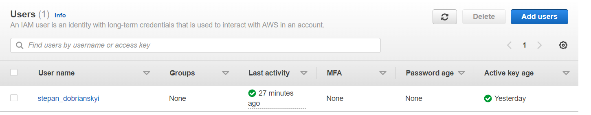
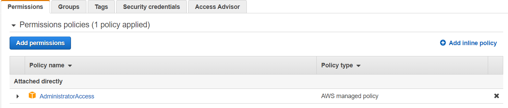

# Лабораторна робота №4
- __Створіть один екземпляр (зображення: ubuntu 20.04)__
- __Дозвольте трафік HTTP/HTTPS на мережевому адаптері__
- __Надайте один відкритий ключ SSH для створеного екземпляра__
- __Встановіть веб-сервер (HTTP-сервер Apache / HTTP-сервер NGINX) за сценарієм bash__
## Добрянський Степан Васильович ІПЗ 1
## Спочатку я створив нового користувача на ASW та надав йому права адміністратора



## Додав потрібні файли для Terraform, щоб створити та налаштувати екземпляр EC2
### key-pair-main
```# Generates a secure private key and encodes it as PEM
resource "tls_private_key" "key_pair" {
  algorithm = "RSA"
  rsa_bits  = 4096
}

# Create the Key Pair
resource "aws_key_pair" "key_pair" {
  key_name   = "${lower("lab4")}-${lower("lab4")}-linux-${lower(var.aws_region)}"
  public_key = tls_private_key.key_pair.public_key_openssh
}

# Save file
resource "local_file" "ssh_key" {
  filename = "${aws_key_pair.key_pair.key_name}.pem"
  content  = tls_private_key.key_pair.private_key_pem
}
```
### linux-variables
```
variable "linux_instance_type" {
  type        = string
  description = "EC2 instance type for Linux Server"
  default     = "t2.micro"
}
variable "linux_associate_public_ip_address" {
  type        = bool
  description = "Associate a public IP address to the EC2 instance"
  default     = true
}
variable "linux_root_volume_size" {
  type        = number
  description = "Volumen size of root volumen of Linux Server"
}
variable "linux_data_volume_size" {
  type        = number
  description = "Volumen size of data volumen of Linux Server"
}
variable "linux_root_volume_type" {
  type        = string
  description = "Volumen type of root volumen of Linux Server."
  default     = "gp2"
}
variable "linux_data_volume_type" {
  type        = string
  description = "Volumen type of data volumen of Linux Server"
  default     = "gp2"
}
```
### linux-vm-main
```
# Create Elastic IP for the EC2 instance
resource "aws_eip" "linux-eip" {
  vpc  = true
  tags = {
    Name        = "${lower("lab4")}-${"lab4"}-linux-eip"
    Environment = "lab4"
  }
}

# Create EC2 Instance
resource "aws_instance" "linux-server" {
  ami                         = data.aws_ami.ubuntu-linux-2004.id
  instance_type               = var.linux_instance_type
  subnet_id                   = aws_subnet.public-subnet.id
  vpc_security_group_ids      = [aws_security_group.aws-linux-sg.id]
  associate_public_ip_address = var.linux_associate_public_ip_address
  source_dest_check           = false
  key_name                    = aws_key_pair.key_pair.key_name
  user_data                   = file("aws-user-data.sh")
  
  # root disk
  root_block_device {
    volume_size           = var.linux_root_volume_size
    volume_type           = var.linux_root_volume_type
    delete_on_termination = true
    encrypted             = true
  }

  # extra disk
  ebs_block_device {
    device_name           = "/dev/xvda"
    volume_size           = var.linux_data_volume_size
    volume_type           = var.linux_data_volume_type
    encrypted             = true
    delete_on_termination = true
  }
  
  tags = {
    Name        = "${lower("lab4")}-${"lab4"}-linux-server"
    Environment = "lab4"
  }
}

# Associate Elastic IP to Linux Server
resource "aws_eip_association" "linux-eip-association" {
  instance_id   = aws_instance.linux-server.id
  allocation_id = aws_eip.linux-eip.id
}

# Define the security group for the Linux server
resource "aws_security_group" "aws-linux-sg" {
  name        = "${lower("lab4")}-${"lab4"}-linux-sg"
  description = "Allow incoming HTTP connections"
  vpc_id      = aws_vpc.vpc.id

  ingress {
    from_port        = 443
    to_port          = 443
    protocol         = "tcp"
    cidr_blocks      = ["0.0.0.0/0"]
    description = "Allow incoming HTTPS connections"
  }
    ingress {
    from_port   = 80
    to_port     = 80
    protocol    = "tcp"
    cidr_blocks = ["0.0.0.0/0"]
    description = "Allow incoming HTTP connections"
  }

  ingress {
    from_port   = 22
    to_port     = 22
    protocol    = "tcp"
    cidr_blocks = ["0.0.0.0/0"]
    description = "Allow incoming SSH connections"
  }

  egress {
    from_port   = 0
    to_port     = 0
    protocol    = "-1"
    cidr_blocks = ["0.0.0.0/0"]
  }

  tags = {
    Name        = "${lower("lab4")}-${"lab4"}-linux-sg"
    Environment = "lab4"
  }
}
```
### network-variables
```
# AWS AZ
variable "aws_az" {
  type        = string
  description = "AWS AZ"
  default     = "eu-central-1a"
}
# VPC Variables
variable "vpc_cidr" {
  type        = string
  description = "CIDR for the VPC"
  default     = "10.1.64.0/18"
}
# Subnet Variables
variable "public_subnet_cidr" {
  type        = string
  description = "CIDR for the public subnet"
  default     = "10.1.64.0/24"
}
```
### nic
```
# Create the VPC
resource "aws_vpc" "vpc" {
  cidr_block           = var.vpc_cidr
  enable_dns_hostnames = true
}
# Define the public subnet
resource "aws_subnet" "public-subnet" {
  vpc_id            = aws_vpc.vpc.id
  cidr_block        = var.public_subnet_cidr
  availability_zone = var.aws_az
}
# Define the internet gateway
resource "aws_internet_gateway" "gw" {
  vpc_id = aws_vpc.vpc.id
}
# Define the public route table
resource "aws_route_table" "public-rt" {
  vpc_id = aws_vpc.vpc.id
  route {
    cidr_block = "0.0.0.0/0"
    gateway_id = aws_internet_gateway.gw.id
  }
}
# Assign the public route table to the public subnet
resource "aws_route_table_association" "public-rt-association" {
  subnet_id      = aws_subnet.public-subnet.id
  route_table_id = aws_route_table.public-rt.id
}
```
### provider-main
```
terraform {
  required_providers {
    aws = {
      source  = "hashicorp/aws"
      version = "~> 3.0"
    }
  }
}
provider "aws" {
  access_key = var.aws_access_key
  secret_key = var.aws_secret_key
  region     = var.aws_region
}
```
### provider-variables
В ньому потрібно вставити дані із __new_user_credentials.csv__
```
variable "aws_access_key" {
  type = string
  default = "access_key"
}
variable "aws_secret_key" {
  type = string
  default = "secret_key"
}
variable "aws_region" {
  type = string
  default = "eu-central-1"
}
```
### ubuntu-version
```
# Get latest Ubuntu Linux Focal Fossa 20.04 AMI
data "aws_ami" "ubuntu-linux-2004" {
  most_recent = true
  owners      = ["099720109477"] # Canonical
  filter {
    name   = "name"
    values = ["ubuntu/images/hvm-ssd/ubuntu-focal-20.04-amd64-server-*"]
  }
  filter {
    name   = "virtualization-type"
    values = ["hvm"]
  }
}

```
### aws-user-data
```
sudo apt-get update
sudo apt-get install -y apache2
sudo systemctl start apache2
sudo systemctl enable apache2
echo "<h1>Stepan Dobrianskyi LAB4</h1>" | sudo tee /var/www/html/index.html
```
## Terraform команди
Щоб ініціалізувати терраформ у директорії потрібно прописати
```
terraform init
terraform apply
```
```terraform apply``` — Створює або оновлює інфраструктуру залежно від конфігураційних файлів. За замовчуванням спочатку буде створено план, який потрібно схвалити перед застосуванням.
```terraform plan``` — Поверне план, що зробить ```terraform apply```
## Запуск віддаленого ubuntu
Потрібно зайти на сам запущений екземпляр та натиснути на __Connect__ 


Там можна буде переглянути готову команду для підключення до віддаленої віртуальної машини
```
ssh -i "lab4-lab4-linux-eu-central-1.pem" ubuntu@ec2-3-64-200-253.eu-central-1.compute.amazonaws.com
```