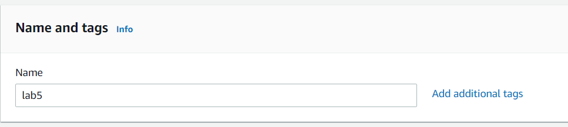
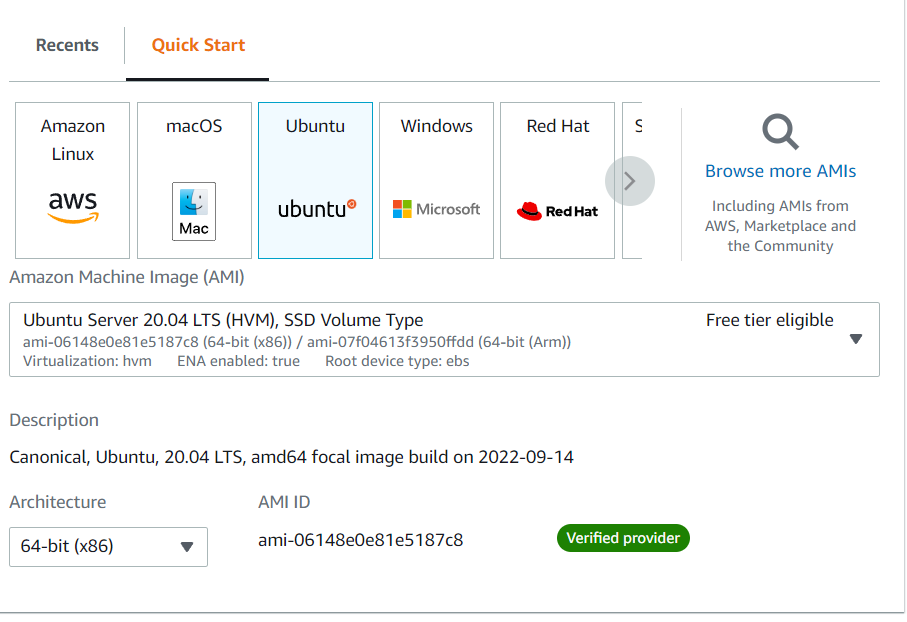
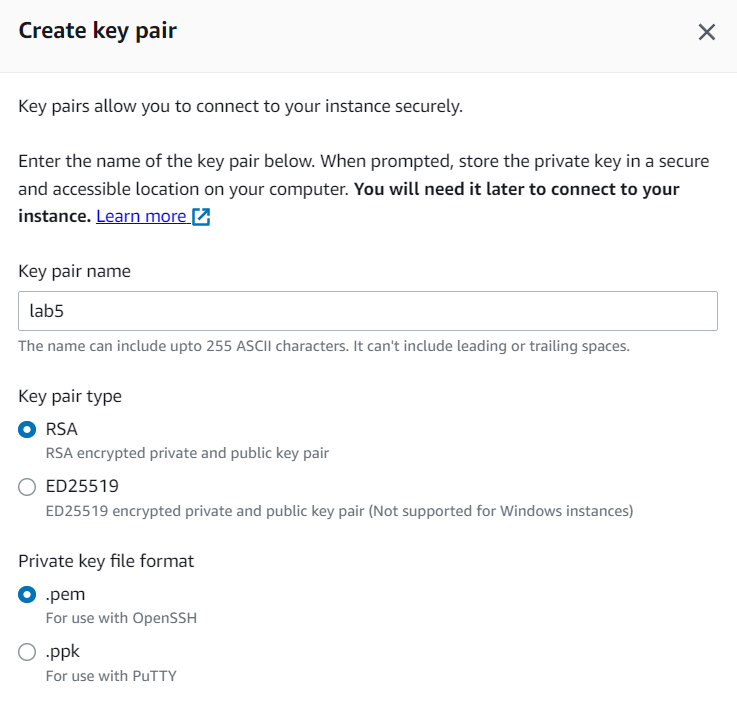
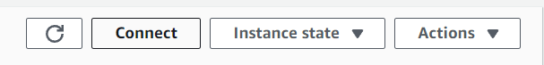
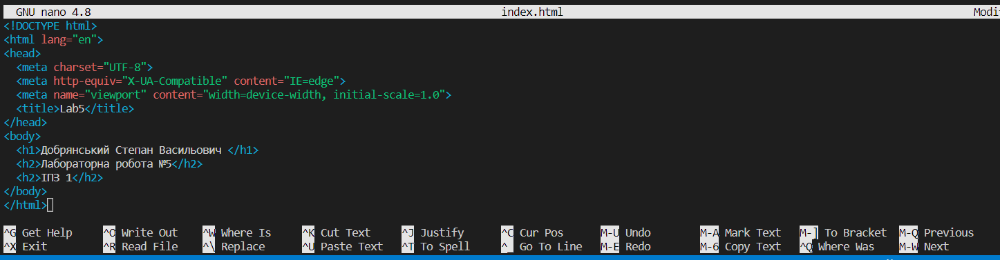

# Лабораторна робота №5. Деплой проекту на AWS EC2.
## План:
- Зареєструватись на AWS. 
- Створити інстанс EC2.
- Задеплоїти проект (може бути  html сторінка) і скинути посилання в звіт для можливості перегляду.

### [Посилання на проект](http://18.156.162.39)

Спочатку я створив аккаунт на AWS та створив користувача ще у 4 лабораторні роботі

### Створення екземпляра
__Спочатку потрібно дати назву екземпляру__



__Вибір на якій операційні системі буде працювати сервер__



__Сторення ключа__



### Підключення до віддаленого ubuntu

Потрібно натиснути кнопку __Connect__



Там буде готове посилання на віддалений ubuntu, його потрібно скопіювати та вставити у термінал (папка з ключем __.pem__)

У самому ubuntu потрібно проінсталювати __apache2__ та вставити проект

Створити index.html



Виконати команду ```sudo cat index.html | sudo tee /var/www/html/index.html```
