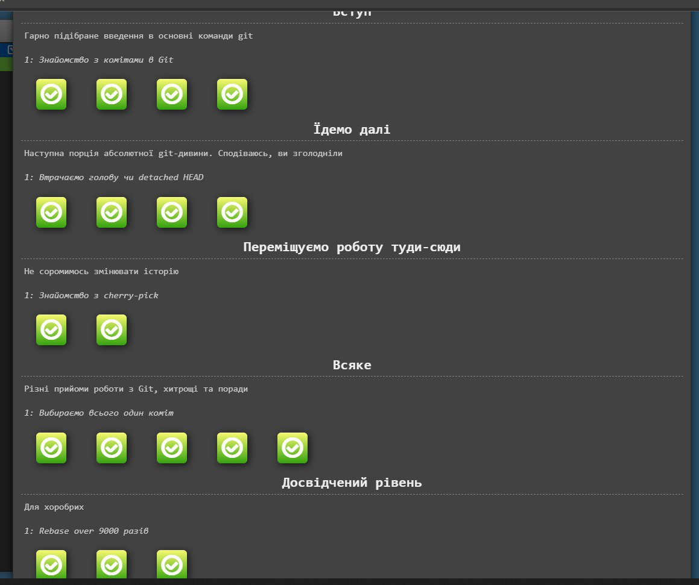
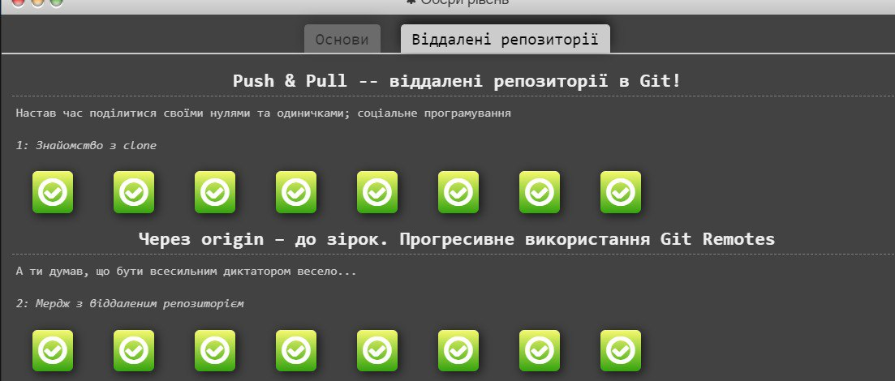

# Лабораторна робота № 2

## Добрянський Степан Васильович

### Студент 3-го курсу ІПЗ 1.1

* Скріншоти з гри по гіту

* Скрін з ініціалізації гіта у проекті

* Скрін з комітом

* Скрін з пушом на репозиторію

## Висновок:
### На лабораторні роботі я вивчив нові функції в git, та навчився використовувати мову розмітки md (MarkDown).